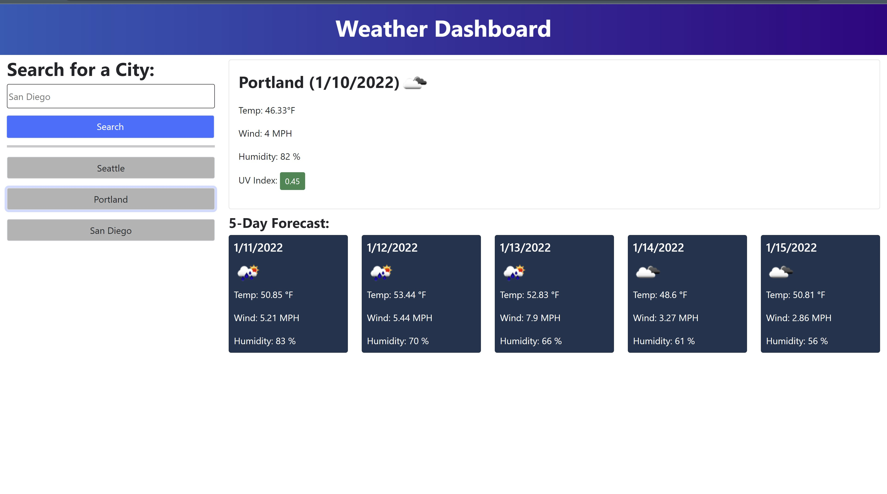

# Weather Dashboard

## Purpose:
A web app that allows users to search for and view weather conditions including temperature, wind speed, and humidity.  The app will also store previous search results in localstorage.

## Built With:
* HTML 
* CSS 
* JavaScript
* OpenWeather One Call API
* Dayjs
* Bootstrap 
* Fontawesome 

## Website/ Links:

https://slemons6.github.io/weather-dashboard

## Credit:
Created by Shayne Lemons